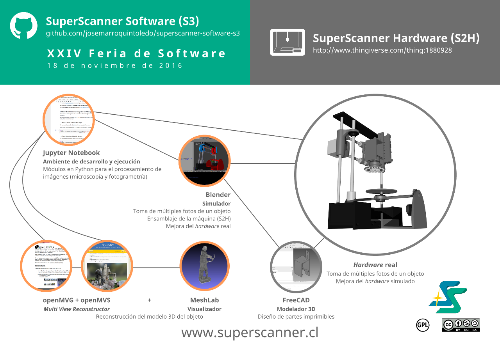

SuperScanner Software (S3)
==========================

SuperScanner Software (S3) is an **free and open-source software environment used for implementing a low-cost scanner 3D**, which can also function as a **microscope and a 3D printer**. S3 is the software portion of [**SuperScanner**](http://en.superscanner.cl) project. SuperScanner Software (S3) is **licensed under [GPLv2](https://www.gnu.org/licenses/old-licenses/gpl-2.0.en.html)** license.

S3 is compatible with [Microscopx](https://www.thingiverse.com/thing:2819042), a project that enhances a low-cost microscope with this software.

The Framework (ES)
------------------



Software Requirements
---------------------

> **Note:** These Jupyter modules has been tested in machinas that run the 64-bit version of [**KDE neon User Edition 5.12**](http://neon.kde.org/) based on the latest **Ubuntu 16.04 LTS**.

S3 is written in Python 3. Some modules can be executed from [Jupyter](http://jupyter.org) notebooks, as scripts in [Blender](https://www.blender.org) or both.

### Common

* [**Git**](https://git-scm.com). Install it from command-line with `$ sudo apt-get install git`. After installing, execute:

```
$ cd ~
$ git clone https://github.com/josemarroquintoledo/superscanner-software-s3.git
```

* [**Anaconda Distribution**](https://www.anaconda.com/download/#linux): Python +  &#171;250+ popular data science packages&#187;. Please, install the version for Python 3, because **S3 only works with Python 3**.

### Microscopy (for [Microscopx](https://www.thingiverse.com/thing:2819042))

[**OpenCV**](https://github.com/opencv/opencv/releases). We have tried with the 3.1.0 version and it works well (to 2018 March, 27th). After installing Anaconda Distribution, go to the command line and execute: `$ conda install opencv`.

### 3D Scanning (simulated)

We suggest the following order:

1. [**openMVG**](https://github.com/openMVG/openMVG) by [pmoulon](https://github.com/pmoulon) to &#171;recover camera poses and a sparse 3D point-cloud from an input set of images&#187;.

2. [**openMVS**](https://github.com/cdcseacave/openMVS) by [cdcseacave](https://github.com/cdcseacave) &#171;to recover the full surface of the scene to be reconstructed&#187; from the camera poses and the sparse 3D point-cloud obtained with openMVG.

3. [**Blender**](https://www.blender.org/download/). It can be installed from the command-line with `$ sudo apt-get install blender`.

4. [**Mesurelt**](https://github.com/Antonioya/blender/tree/master/measureit) (optional) by [Antonioya](https://github.com/Antonioya) is an add-on &laquo;for displaying measures \[of meshes\] in the vewport&raquo; in Blender. Download the ZIP file and install it in Blender from **File** &rarr; **User Preferences...** &rarr; **Add-ons** &rarr; <kbd>Install from File...</kbd>

5. [**py3exiv2**](http://www.py3exiv2.tuxfamily.org): Allows to use the lib exiv2 with Python 3. exiv2 is a C++ library designed to handle the EXIF image metadata.

6. [**IPython for Blender**](https://github.com/panzi/blender_ipython) by [panzi](https://github.com/panzi) to run Blender scripts in Jupyter notebooks. Before installing, make sure you installed the dependences. Anaconda Distribution does not resolve them: `$ sudo apt-get install python3-pip & sudo pip3 install --upgrade pip jupyter ipython notebook`.

7. [**MeshLab**](http://meshlab.sourceforge.net). Install with: `$ sudo apt-get install meshlab`.

Folders' Descriptions
--------------------

Within the main folder:

* [**arduino**](arduino/): Contains **Arduino sketch projects'** folders. For example, there is a sketch to turn Pixels on or off, test them or set a custom lighting sequence of the NeoPixel illuminator of [Microscopx](https://www.thingiverse.com/thing:2819042).

* [**blend-meshes**](blend-meshes/): Folder for the **printable parts and pieces** of SuperScanner Hardware (S2H), **the complete model** of the machine manipulable in Blender and **scenes that execute the Blender scripts**.

* [**examples**](examples/): Folder with **sample Jupyter notebooks** to try, for example, the Fourier Ptychography imaging technique from a simulated or real image set.

* [**img**](img/): Contains some **pictures** that are used by some notebooks.

* [**jupyter-modules**](jupyter-modules/): Where the **Python modules written as Jupyter notebooks** are stored. For example, there are notebooks that are used by the Fourier Ptychography reconstruction algorithm and access to the data and functions of Blender outside of this and simulate the picture taking process for photogrammetry.

* [**parts**](parts/): For now, the **FreeCAD source and STL files of [Microscopx](https://www.thingiverse.com/thing:2819042)** are stored there.

* [**scripts**](scripts/): Contains **Python scripts** (.py), for example, to call the external software during the photogrammetry process and put the LEDs in the illuminator in the blend model of the machine (S2H).

Importing and Executing the Code
--------------------------------

### In Blender

Blend scripts can be imported in Blender from **Choose Screen layout**&rarr;**Scripting**&rarr;<kbd>Open</kbd>. To execute them, press <kbd>Run Script</kbd> button and wait for the result.

Main References
----------

Spring, K.; Komatsu H.; Scott, M.; Schwartz, S.; Fellers, T.; Carr, K.; Parry-Hill, M y Davidson, M. (2017). *Microscopy Basics | MicroscopyU*. Retrieved from https://www.microscopyu.com/microscopy-basics

UCLA Technology Development Group. (2017). *Computational Out-Of-Focus Imaging Increases The Space-Bandwidth Product In Lens-Based Coherent Microscopy*. Retrieved from https://techtransfer.universityofcalifornia.edu/NCD/28827.html

Zheng, G. (2016). *Fourier Ptychographic Imaging: A MATLAB® tutorial*. San Rafael, CA: Morgan & Claypool Publishers.
